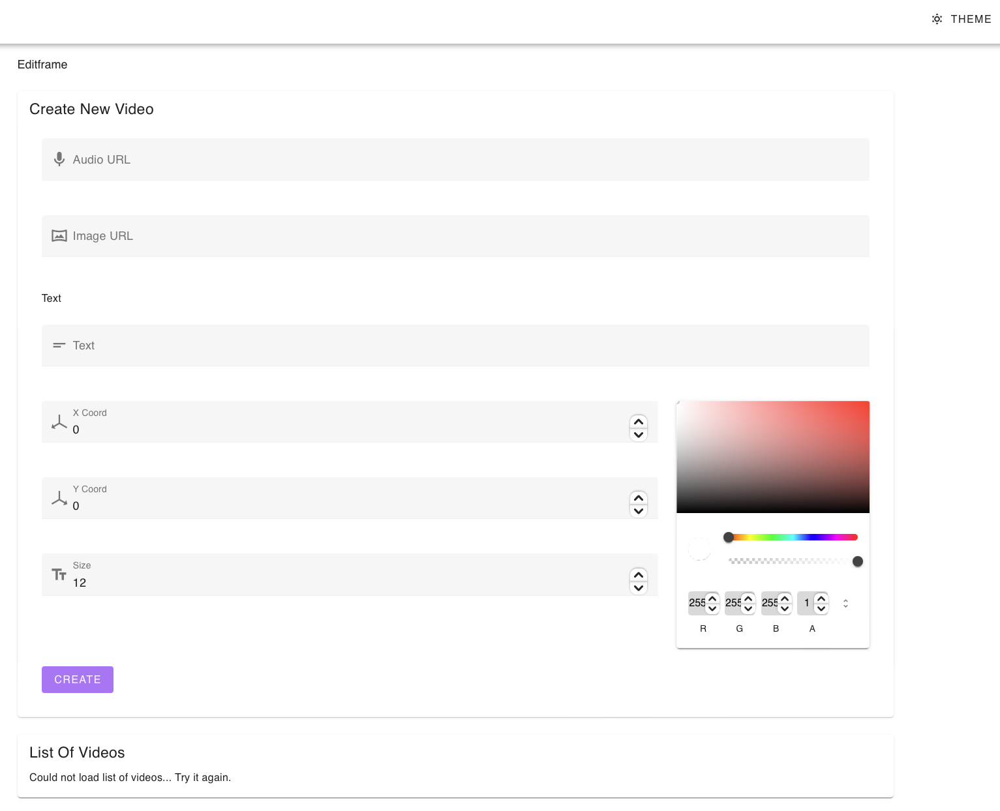

# Editframe

This repository consists of code implementing home assignment for the Editframe hiring process. The assignment itself can be found in [/docs/Assignment.md](./docs/Assignment.md) file.

Key points:

- Implement the backend with the following REST API endpoints:
  - POST `/videos`
  - GET `/videos`
- Implement script in TypeScript for:
  - Creating 7s long video using Editframe's SDK
  - Downloading video from Editframe's backend
- Create frontend with a list of existing videos

## Prerequisites

Make sure you have installed the following tools and libraries before starting the project up:

- Redis
- ffmpeg

## Configuration

Rename file `.env.default` to `.env` and edit its content:

- `EDITFRAME_API_URI` - Should contain value https://api.editframe.com/v2
- `EDITFRAME_CLIENT_ID` - Put in your Editframe client ID.
- `EDITFRAME_API_TOKEN` - Set to your Editframe token.
- `REDIS_HOST` - The application requires that Redis server is up and running. Enter its IP address.
- `REDIS_PORT` - Enter the port that Redis server is listening at.
- `BACKEND_API_PORT` - Enter the port number that the backend should be listening at.

Example content:

```
EDITFRAME_API_URI=https://api.editframe.com/v2
EDITFRAME_CLIENT_ID=abcdf123
EDITFRAME_API_TOKEN=987654ggjj
REDIS_HOST=127.0.0.1
REDIS_PORT=6379
BACKEND_API_PORT=8000
```

## Set-up process

Export `NPM_TOKEN` for Editframe SDK:

    export NPM_TOKEN=[TOKEN]

Install dependencies:

    yarn install

> Following commands are blocking until Control+C'd. Either run them in the background (via adding & at the end) or execute each of them in a new terminal tab.

Run Redis server:

    yarn run redis:start

Start queue task runner:

    yarn run runner:start

Start backend:

    yarn run backend:start

Start frontend:

    yarn run frontend:start

# Using frontend

The Frontend application should be available at http://localhost:3000. It allows you to create new videos and download already converted ones.



Example input:

- Audio - https://lillillliiililiil.ililllliliillilliliil.li/direct/SL183jbPq4/
- Photo - https://unsplash.com/photos/0J8thHZfosE/download?ixid=MnwxMjA3fDF8MXxhbGx8MTF8fHx8fHwyfHwxNjc1NDM2NDQw&force=true&w=640

# Architecture

My implementation of the assignment consists of the following parts:
- Backend - NestJS application written in TypeScript. Its responsibility is to exchange data between Frontend and Editframe server. In addition, it's communicating via Queue (Bull) with Task Runner.
- Task Runner is simple TypeScript file consuming events on Queue. When a new task is pushed, Task Runner requires new composition from Editframe, then downloads it and extracts audio into a separate file.
- Frontend - NuxtJS application written in Typescript. It's using Vuetify components, TailwindCSS for (few) styles, and Axios for communication with the Backend.

```
                       ┌─────────────┐       ┌──────────────┐
                       │             │       │              │
     New      .─.      │   Backend   │       │    Queue     │
    Video    (   )────▶│             │──────▶│              │
   Request    `─'      │             │       │              │
                       └─────────────┘       └──────────────┘
                                                     │
                                                     ▼
                       ┌─────────────┐       ┌──────────────┐
                       │             │       │              │
                       │   Storage   │       │    Script    │
                       │             │◀─────▶│    Runner    │
                       │             │       │              │
                       └─────────────┘       └──────────────┘
```

## Decisions
- I prefer having the same language on Frontend and Backend. This limits the selection of usable languages by a lot. JS, respectively TS was selected.
- Based on the programming language, I selected NestJS as the backend library. It's a battery-loaded and production-ready library similar to Laraver.
- Bull was selected as a Queue library for task exchange between Backend and Script Runner. With proper scaling, there could be hundreds and thousands of instances of Script Runner which should satisfy even heavy loads.
- On the frontend, Vue in combination with NuxtJS was selected. I am fairly familiar with those libraries and using Vue rather than React seems logical for projects of this "scale".

## Quirks and what could be done differently

For the sake of simplicity, many corners were cut. Naming few:

- No proper management of logs. They are all over the place.
- No scaling of Script Runner - there should be a pool of them.
- Adding support for OpenApi documentation via Swagger.
- Safer checks on user input when downloading the audio file. `path.normalize` should solve directory traversal, however, there are many other ways to harm the server.
- Better Queue monitoring. At the moment, there is a Bull Dashboard available at http://localhost:8000/admin/queues. It's freely available without authorization.
- Better configuration file handling. I have implemented simple type checking, but the property path is not typed via Typescript. There still may occur some problems when the programmer makes a typo in the key name.
- Better error handling on FE. There is none at the moment.
- Adding crash report utility - Bugsnag, Sentry, Splunk, ...
- Adding tests

## Why no PHP

I have tried implementing the Backend in PHP as well as in Node. The problem was, I started with the Node version. As far as I know, there is no direct Laravel -> Bull library. It would require some fiddling with sending raw Redis commands. That could be another improvement mentioned in the list above.

## Takeaways

- Documentation of Editframe SDK could be improved.
- I would love to get some more information about why video conversion failed.
- Editframe SDK should be generated in a way that following function definition with mouseclick leads to the function itself and not the list of all KEY : value pairs. It takes time to find appropriate function declarations with types.
